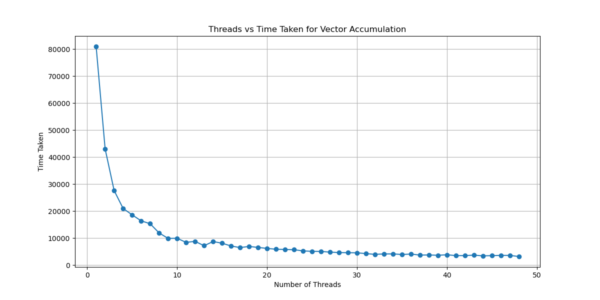

# C++ Parallel Accumulation Benchmark

A custom implementation of a parallel vector accumulator to study multithreading efficiency, Amdahl's Law, and memory bandwidth limitations in modern hardware.

## Background

While learning concurrency in C++ using Anthony Williams' excellent textbook *"C++ Concurrency in Action"*, I wanted to test how the theory translates to physical silicon. 

Instead of just looking at the algorithm, this project benchmarks a parallel accumulator against a massive dataset (500 million integers, ~4GB of memory) to observe what happens when CPU execution speed drastically outpaces the system's memory controller. 

## Hardware Test Environment

The benchmarks and corresponding performance graphs were generated on a High-Performance Computing (HPC) node. The relevant configuration for this memory-bound workload is:

* **Processor:** Dual Intel® Xeon® Gold 5318N @ 2.10GHz
* **Concurrency:** 48 Physical Cores / 48 Logical Threads (Hyper-threading disabled)
* **Topology:** 2 Sockets / 2 NUMA Nodes *(Note: The dual NUMA architecture is a primary bottleneck here, as memory bandwidth saturation occurs across the CPUs' respective memory controllers).*
* **L3 Cache:** 36MB

##  Repository Structure & Results

This repository contains two complementary benchmarking experiments:

### 1. `threads_vs_time.cpp` (The Thread Sweep)
This script answers the question: *"How does the algorithm scale as execution units increase?"*
It iterates from 1 thread up to the maximum hardware concurrency of the machine (48 threads), profiling the efficiency. This benchmark reveals the physical memory bandwidth limits of the system. 

### 2. `parallel_accumulate.cpp` (The Head-to-Head)
This script runs a direct, multi-iteration averaged comparison between the custom parallel algorithm (utilizing max hardware threads) and the baseline sequential `std::accumulate()`. It also strictly validates the mathematical results to ensure data integrity.

**Performance Results (Average over 10 iterations on 500M elements):**
* **Sequential (`std::accumulate`):** 3847 ms
* **Parallel (Custom, 48 Threads):** 151 ms 

*(Note: The impressive 151 ms parallel execution time **includes** the overhead of creating, scheduling, and joining 47 new operating system threads on every iteration!)*

##  Key Findings: The Memory Bottleneck

When running the sweep (`threads_vs_time.cpp`), the performance curve clearly demonstrates three distinct phases of parallel execution:

*(Note: Be sure to upload your graph image to the repository and ensure the filename matches the link above!)*

* **Phase 1 (Linear Scaling):** With a low thread count (1–4), the workload is compute-bound. Scaling is nearly 1:1 as the active cores have unhindered access to L1/L2 caches and memory controllers.
* **Phase 2 (Diminishing Returns):** As thread count increases (8–16), the system transitions to being memory-bandwidth-bound. Because simple addition is incredibly fast for modern CPUs, the cores begin processing data faster than the system RAM can supply it over the bus.
* **Phase 3 (The Hard Plateau):** At higher thread counts (20–48), the memory controllers reach full saturation. Throwing more threads at the problem yields zero marginal performance gains. The CPU cores are forced into wait-states, and adding threads only increases OS scheduling and context-switching overhead.

**Takeaway:** Writing fast parallel code requires more than just utilizing `std::thread`; it requires an intimate understanding of the physical limits of your target architecture. 